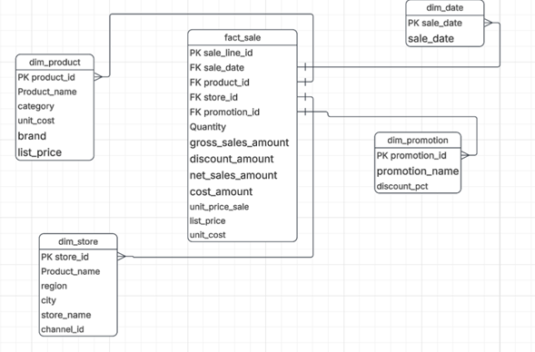

# LAB-2 — From Business Requirements to a Dimensional Data Warehouse

**Course:** ETL (G01) — Data Engineering and Artificial Intelligence, Universidad Autónoma de Occidente

## 1. Project Objective and Business Scenario

A retail technology company operates two physical stores and one national online
store. This project consolidates six months of sales data (January–June 2026)
into a small **Star Schema Data Warehouse**, implemented in **SQLite**, so that
management can answer five recurring analytical questions without touching the
raw source files.

The focus of this lab is **dimensional modeling**, not a complex ETL pipeline:
the source data is already clean, so the challenge is to translate business
requirements into the right grain, dimensions, and facts.

## 2. Business Requirements

| ID | Business Requirement |
|---|---|
| R1 | Monitor monthly net sales trends and identify periods of growth or decline. |
| R2 | Compare sales performance across stores and sales channels over time. |
| R3 | Identify the top-performing product categories and brands using revenue and units sold. |
| R4 | Evaluate promotion performance by comparing sales, units, and discounts across promotion types. |
| R5 | Analyze gross profit and gross margin by product category, store, and month. |

## 3. System Architecture / Pipeline

```
Business Requirements → Source Data (CSV + JSON) → ETL (Python) → Dimensional
Model (SQLite Star Schema) → SQL / KPIs → Business Decisions
```

| Block | Input | Responsibility | Output |
|---|---|---|---|
| Source Data | `sales_transactions.csv`, `reference_data.json` | Raw, mostly-clean transactional and reference data | 1,000 sales lines + product/store/channel/promotion catalogs |
| ETL (`src/`) | Source Data | Create schema, load dimensions, map natural keys → surrogate keys, calculate measures, load fact table | Populated `retail_dw.db` |
| Dimensional Model | Populated `retail_dw.db` | Store data in a query-friendly Star Schema | Queryable fact + dimension tables |
| SQL / KPIs (`queries.py`) | Dimensional Model | Answer each business requirement with a dedicated query | DataFrames / KPI tables |
| Business Decisions | KPIs & visualizations | Support decisions on inventory, store performance, promotions, pricing | Charts in `docs/` |

## 4. Business Process and Fact Table Grain

- **Business process:** Retail Sales — sales transactions across two physical
  stores and one online store, covering products, dates, sales channels, and
  promotion conditions.
- **Grain (one sentence):** One row in `fact_sales` represents one product
  sold, on one sales line of one transaction, at one store, through one sales
  channel, on one specific date, under one promotion condition (or "no
  promotion").

## 5. Star Schema Diagram



- **Fact table:** `fact_sales`, connected to four dimensions through foreign
  keys on their surrogate primary keys.
- **Dimensions:** `dim_date`, `dim_product`, `dim_store`, `dim_promotion`.
- No `dim_channel` was created: channel is a static, low-cardinality attribute
  of a store (`channel_id` / `channel_name`) and is denormalized directly into
  `dim_store`, since no requirement needs an independent channel dimension.

## 6. Dimensions, Facts, and Measures

### Dimensions

| Dimension | Business Question Supported | Main Attributes | Key |
|---|---|---|---|
| `dim_date` | How do sales evolve over the six-month period? (R1, R2, R5) | sale_date, year, month, month_name, day | `date_key` (surrogate) / natural key `sale_date` |
| `dim_product` | How do products perform by category and brand? (R3, R5) | product_id, product_name, category, brand, unit_cost, list_price | `product_key` (surrogate) / natural key `product_id` |
| `dim_store` | Which stores and channels perform best? (R2, R5) | store_id, store_name, city, region, channel_id, channel_name | `store_key` (surrogate) / natural key `store_id` |
| `dim_promotion` | How do promotion types affect sales? (R4) | promotion_id, promotion_name, discount_pct | `promotion_key` (surrogate) / natural key `promotion_id` |

### Fact table measures (`fact_sales`)

| Measure | Calculation | Requirement |
|---|---|---|
| Quantity | `quantity` (source field) | R1–R5 |
| Gross Sales Amount | `quantity × list_price` | R1, R3, R5 |
| Net Sales Amount | `quantity × unit_price_sale` | R1, R2, R3, R4, R5 |
| Discount Amount | `Gross Sales Amount − Net Sales Amount` | R4 |
| Cost Amount | `quantity × unit_cost` | R5 |
| Gross Profit | `Net Sales Amount − Cost Amount` | R5 |

**Gross Margin % is NOT stored.** It is calculated only at query time as
`Gross Profit / Net Sales Amount × 100`, because averaging a pre-calculated
percentage across grouped rows would give an incorrect result — it must be
derived from the summed numerator and denominator.

## 7. Load Order and Surrogate-Key Strategy

1. `create_schema.py` creates the 4 dimension tables and `fact_sales`, with
   `PRAGMA foreign_keys = ON` and indexes on every foreign key.
2. `load_dimensions.py` loads **dimensions first**:
   `dim_date` (built from the distinct `sale_date` values in the CSV),
   `dim_product`, `dim_store` (joined with `channels` to resolve
   `channel_name`), `dim_promotion`.
3. `load_fact.py` reads `sales_transactions.csv`, joins each row against the
   four dimension tables on their **natural keys** to resolve the
   corresponding **surrogate keys**, calculates the six measures, and inserts
   one row per sales line into `fact_sales` — preserving the declared grain.

All surrogate keys are auto-incrementing integers, independent from the
source system identifiers. Natural keys (`product_id`, `store_id`,
`promotion_id`, `sale_date`) are preserved as regular attributes for
traceability.

## 8. Execution Instructions

```bash
# from the repository root
pip install -r requirements.txt

python src/main.py
```

This single command runs the full pipeline: creates the schema, loads the
dimensions, loads the fact table, prints the validation queries for R1–R5,
and regenerates the two charts in `docs/`.

To re-run only the SQL validation queries after the database is built:

```bash
python src/queries.py
```

## 9. SQL Queries / KPIs Mapped to Business Requirements

| Requirement | Query (in `src/queries.py`) | KPI |
|---|---|---|
| R1 | `Q_R1_MONTHLY_NET_SALES` | Monthly Net Sales trend, Jan–Jun 2026 |
| R2 | `Q_R2_SALES_BY_STORE_CHANNEL`, `Q_R2_SALES_BY_CHANNEL_TOTAL` | Net Sales & Units by store/channel, by month |
| R3 | `Q_R3_SALES_BY_CATEGORY_BRAND`, `Q_R3_SALES_BY_CATEGORY_TOTAL` | Net Sales & Units by category and brand |
| R4 | `Q_R4_SALES_BY_PROMOTION` | Net Sales, Units and Discount Amount by promotion |
| R5 | `Q_R5_PROFIT_BY_CATEGORY_STORE_MONTH`, `Q_R5_MARGIN_BY_CATEGORY` | Gross Profit & Gross Margin % by category/store/month |

Referential integrity was validated with `PRAGMA foreign_key_check` — **zero
violations** across all 1,000 fact rows.

## 10. Analytical Visualizations and Interpretation

**Visualization 1 — R1 (temporal): Monthly Net Sales Trend**
`docs/viz1_monthly_net_sales_trend.png`

Net sales grew steadily from **~174.3M COP in January** to a peak of
**~269.1M COP in May**, before a slight dip to **~262.4M COP in June**. The
five-month growth streak suggests healthy demand or effective seasonal
promotions through Q1–Q2, while the June dip is worth monitoring in the next
reporting cycle.

**Visualization 2 — R3 (comparative): Net Sales by Product Category**
`docs/viz2_net_sales_by_category.png`

**Computers** is the leading category by revenue (~605.7M COP), followed by
**Mobile Devices** (~459.5M COP), **Accessories** (~219.9M COP), and **Smart
Home** (~108.3M COP). However, R5 shows Accessories has the highest gross
margin (~51%), while Computers has the lowest (~16%) — high-revenue
categories are not necessarily the most profitable ones.

## 11. Final Reflection

**How did the business requirements influence the dimensional model?**
Every dimension and measure exists only because a requirement needed it.
For example, `dim_promotion` and `discount_amount` exist solely to answer
R4; `unit_cost` was pulled into `dim_product` solely to support the R5
profitability analysis. No requirement needed a channel dimension of its
own, so channel was denormalized into `dim_store` instead of creating a
fifth table.

**What would be the impact of choosing an incorrect grain?**
A coarser grain (e.g., one row per transaction instead of per sales line)
would make it impossible to analyze sales by individual product, since a
single transaction can contain several different products. It would also
break additive measures: quantity and net sales could no longer be summed
correctly by product or category, corrupting R1, R3, and R5. A finer grain
than the source data supports would require inventing data that doesn't
exist.

**Did the final model contain any table or attribute not necessary for the
selected requirements?**
No. `list_price` and `unit_cost` were deliberately kept only in
`dim_product` (not duplicated in the fact table) because they belong to the
product, not the transaction; `transaction_id` was kept in `fact_sales` as a
degenerate attribute purely for line-level traceability, not because any
requirement aggregates by it. Gross Margin % was intentionally **not**
stored, to avoid an incorrect average-of-percentages if someone later
aggregates the fact table naively.

## 12. Repository Structure

```
lab2-dimensional-dw/
│
├── data/
│   ├── sales_transactions.csv
│   └── reference_data.json
│
├── src/
│   ├── create_schema.py
│   ├── load_dimensions.py
│   ├── load_fact.py
│   ├── queries.py
│   └── main.py
│
├── database/
│   └── retail_dw.db
│
├── docs/
│   ├── star_schema.png
│   ├── viz1_monthly_net_sales_trend.png
│   └── viz2_net_sales_by_category.png
│
├── README.md
├── requirements.txt
└── .gitignore
```
